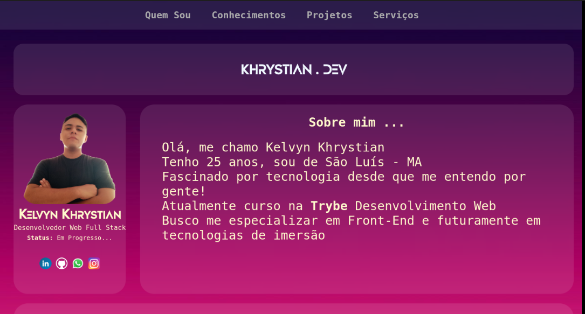

# Kelvyn Khrystian 
### Este repositório possui 2 objetivos: Manter o página online e demonstrar minha evolução pessoal a partir do 0! Link para o portifólio atual: https://kelvynkhrystian.github.io/

## **Atual Portifólio (HTML e CSS)** 
https://user-images.githubusercontent.com/94154348/185295357-165ee8cb-0b1c-482d-b76e-172f3183e42e.mp4

# **Primeiro Portifólio (HTML)**
### Feito como exercício proposto nos primeiros dias estudando HTML

# Portifólio Fase 2 (HTML e CSS)
###  Algumas semanas estudando sobre Linux e seu terminal, Git, Github, HTML Responsivo e CSS Flexbox

# Portifólio Fase 3  (HTML, CSS, JS)
## Adotando o método Mobile First e aprendendo JavaScript
### Status: em breve...
